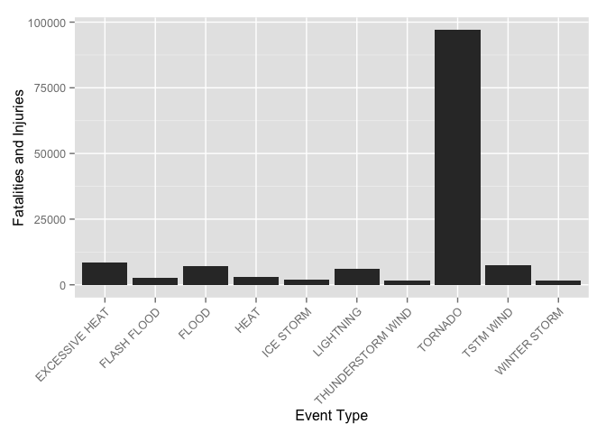
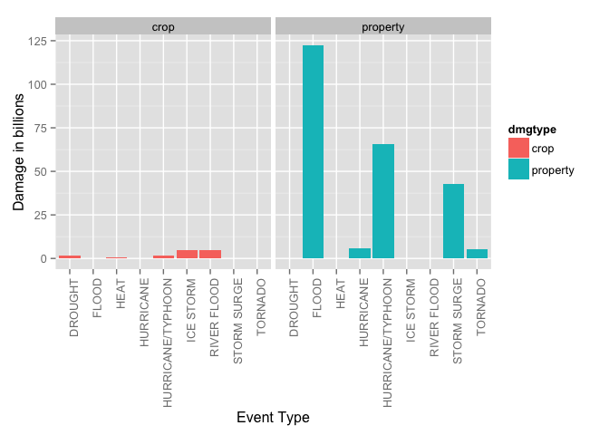

# The Top Storms from 1950-2011
Rose Nyameke  
November 22, 2015  
Using data from the NOAA Storm database, I explore the impact of storms and other
natural disasters on the health of the population and on the economy.
To show the impact of storms on the health of the population, I extract the
five storms that resulted in the most injuries and fatalities. In order to capture
the economic impact of storms, I selected the five storms that caused the greatest
property damage, as well as the five that caused the greatest crop damage.
I found that, with the exception of hurricanes, the storms that caused the greatest
property damage did not also cause the greatest crop damage. Additionally, the most
property-damaging storm did more damage than all the top crop-damaging storms
combined. Lastly, four out of the top property and crop-damaging storms were also
among the top ten that impacted the health of the population.

##Data Processing

```r
#url <- "https://d396qusza40orc.cloudfront.net/repdata%2Fdata%2FStormData.csv.bz2"
#download.file(url, destfile = "event_data.csv.bz2", method = "curl")
data <- read.csv("event_data.csv.bz2")
library(dplyr)
library(ggplot2)
```

###Most harmful with respect to population health
For this section, I used the total number of injuries and fatalities as an indicator
of impact on population health.


```r
# selecting top 10 events with highest fatalities and injuries (combined)

# subsetting evtype, injuries and fatalities columns
health_imp <- subset(data, select = c(EVTYPE, INJURIES, FATALITIES))
     
#group by event type
health_imp <- group_by(health_imp, EVTYPE)

#sum of fatalities and injuries by event
health_imp <- summarize(health_imp, sum(INJURIES), sum(FATALITIES))

#rename columns to remove the sum function from the names
names(health_imp) <- c("evtype", "injuries", "fatalities")

# creating the column to hold the total of injuries and fatalities
health_imp$total <- health_imp$injuries + health_imp$fatalities

#order the data frame by total column & select the top 10
health_imp <- health_imp[order(-health_imp$total), ]
top_health_imp <- health_imp[1:10, ]

#comparing the numbers
health_graph <- ggplot(data = top_health_imp, aes(x = evtype, y = total)) + geom_bar(stat = "identity") + xlab("Event Type") + ylab("Fatalities and Injuries") + theme(axis.text.x = element_text(angle = 45, hjust = 1))
```

###Events with the most economic impact

```r
#selecting only the evtype, crop damage and property damage columns (plus their exponents)
prop_data <- subset(data, select = c(EVTYPE, PROPDMG, PROPDMGEXP))
crop_data <- subset(data, select = c(EVTYPE, CROPDMG, CROPDMGEXP))
     
#group by event type and exponents
prop_data <- group_by(prop_data, EVTYPE, PROPDMGEXP)
crop_data <- group_by(crop_data, EVTYPE, CROPDMGEXP)

#sum of property and crop damage by event, keeping separate by exp
prop_summary <- summarize(prop_data, sum(PROPDMG))
crop_summary <- summarize(crop_data, sum(CROPDMG))

#rename columns to remove the sum function from the names
names(prop_summary) <- c("evtype", "propdmgexp", "propdmg")
names(crop_summary) <- c("evtype", "cropdmgexp", "cropdmg")
```

Upon inspection, the top 5 in each category will be in billions. I therefore decided to
select only the rows that recorded property or crop damage in billions.


```r
prop_dmg <- subset(prop_summary, propdmgexp == "B")
crop_dmg <- subset(crop_summary, cropdmgexp == "B")

#ordering from highest to lowest
top_prop_dmg <- prop_dmg[order(-prop_dmg$propdmg), ]
top_crop_dmg <- crop_dmg[order(-crop_dmg$cropdmg), ]

#top 5 in each category
top_prop_dmg <- top_prop_dmg[1:5,]
top_crop_dmg <- top_crop_dmg[1:5,]

#combining the data sets before plotting
#####renaming the damage columns
names(top_prop_dmg) <- c("evtype", "dmgexp", "dmg")
names(top_crop_dmg) <- c("evtype", "dmgexp", "dmg")

top_prop_dmg$dmgtype <- "property"
top_crop_dmg$dmgtype <- "crop"

top_damage <- rbind(top_prop_dmg, top_crop_dmg)
top_damage$dmgtype <- as.factor(top_damage$dmgtype)

#graphs
damage_graph <- ggplot(data = top_damage, aes(x = evtype, y = dmg, fill = dmgtype)) + geom_bar(stat = "identity") + xlab("Event Type") + ylab("Damage in billions") + facet_wrap(~dmgtype) + theme(axis.text.x = element_text(angle = 90, hjust = 1))
```

##Results
###Health Impact
The events that had the biggest effect on population health, as determined by the
total number of injuries and fatalities are shown below:

```r
print(health_graph)
```

 

**Figure 1: events with the biggest effect on population health**

Within these top ten events, tornadoes had significantly larger effects on population health
than the other events.  

###Economic Impact
The events that had the biggest economic impact are shown below. Note that the axes
for both categories show a combination of all the events that caused the most
damage (hence the blank variables).

```r
print(damage_graph)
```

 

**Figure 2: events with the biggest economic effect**

As this figure shows, the property damage caused by these events significantly exceeds
the crop damage.
